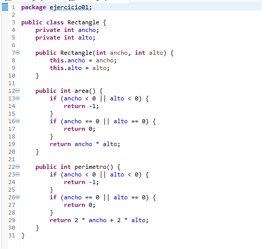
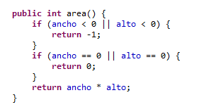
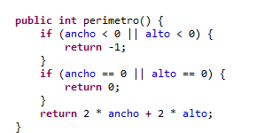
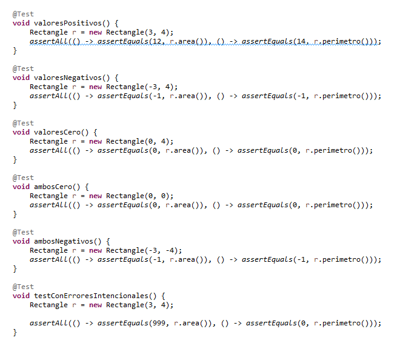
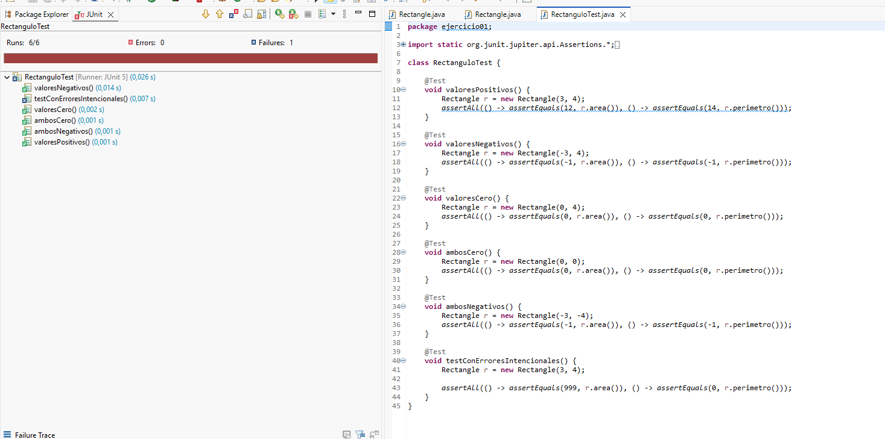
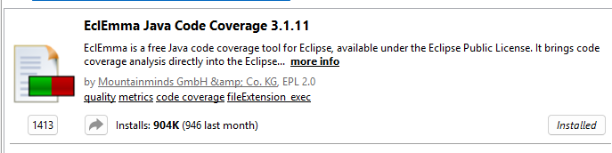
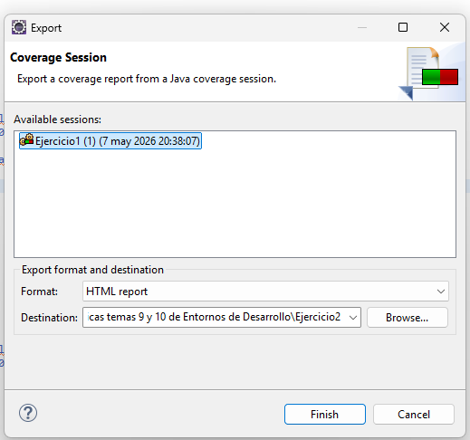
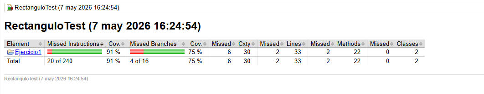
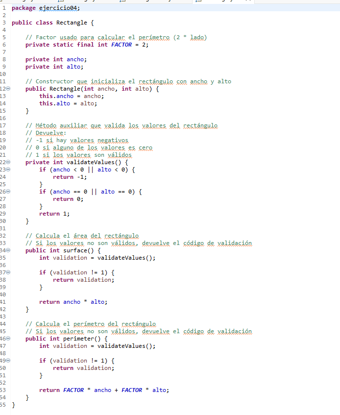
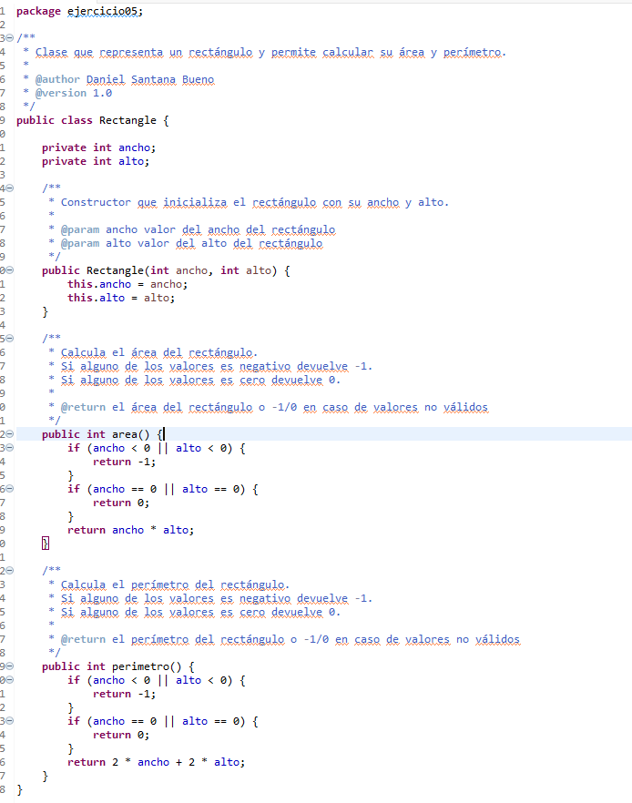

# PRACTICAS - TEMA 9 y 10

## Descripción general

Este repositorio contiene varias prácticas relacionadas con el uso de herramientas de desarrollo en Java, centradas en pruebas unitarias, análisis de código, cobertura, refactorización y documentación.

---

## Ejercicio 1 – Tests unitarios con JUnit 5

  

### 1.1 Descripción

En este ejercicio se trabaja con JUnit 5 en Eclipse para introducir el concepto de pruebas unitarias en Java.
Se utiliza una clase `Rectangulo`, sobre la que se implementan pruebas para validar el correcto funcionamiento de sus métodos.

  

Se implementa una clase `Rectangulo` con los métodos:

- `area()`

  

- `perimetro()`

  

---

### 1.2 Cambios realizados en la clase

Se han añadido validaciones a los métodos:

- Si algún valor es negativo, el método devuelve `-1`.
- Si algún valor es `0`, el método devuelve `0`.
  
---

### 1.3 Casos de prueba

Se han creado tests para cubrir:

- Valores positivos
- Valores negativos
- Valores iguales a cero

  

También se incluyen aserciones para comprobar el correcto funcionamiento del sistema de tests.

  

---

## Ejercicio 2 – Cobertura de tests con EclEmma

  

### 2.1  Descripción

Se utiliza la herramienta **EclEmma** para analizar la cobertura de los tests unitarios.

El objetivo es comprobar qué partes del código han sido ejecutadas por las pruebas.

---

### 2.2 Ejecución de la cobertura

Se ejecutan los tests unitarios desarrollados en el ejercicio anterior utilizando la opción **Coverage As** en Eclipse mediante el plugin EclEmma.

Esto permite obtener información detallada sobre:

- Líneas de código ejecutadas por los tests.
- Ramas del código no cubiertas.
- Porcentaje total de cobertura del proyecto.

---

### 2.3 Exportación de informe

Se busca alcanzar una cobertura lo más cercana posible al 100%, asegurando que todas las ramas del código han sido evaluadas.

  

Exportaremos el informe...

  

---

### 2.4 Documento de cobertura
Una vez alcanzado un nivel de cobertura adecuado, preferiblemente cercano al 100%, se genera un informe de cobertura utilizando la opción **Coverage Report** en Eclipse.

Este informe permite:

Visualizar el porcentaje global de cobertura, analizar la cobertura por clases y métodos e identificar partes del código que podrían mejorarse en los tests.

  

---

## Ejercicio 3 – Análisis de código con SonarLint

  

### 3.1 Descripción

Se utiliza **SonarLint** para analizar el código en tiempo real dentro de Eclipse.

La herramienta detecta posibles problemas de calidad, estilo y buenas prácticas.

---

### 3.2 Documentación SonarLint - SonarQube
[Click aqui](Ejercicio3/SantanaDaniel_Ejercicio03_SonarLint.pdf) para ver la documentacion sobre las herramientas **SonarQube** y **SonaLint**, donde se muestran sus diferencias, similitudes y distintos casos de uso. Además veras capturas sobre la ejecucion de la herramienta principal sobre ``Rectangulo``

---

## Ejercicio 4 – Refactorización en Eclipse

### 4.1 Descripción

Se aplican técnicas de refactorización sobre el proyecto inicial.

---

### 4.2 Cambios realizados

- Extracción de constantes (valor 2 en perímetro)
- Renombrado de métodos:
  - `area` → `surface`
  - `perimetro` → `perimeter`
- Renombrado de clase:
  - `Rectangulo` → `Rectangle`
- Extracción de lógica común para validación de parámetros

  

---

### 4.3 Validación

Después de cada refactorización se vuelven a ejecutar los tests para comprobar que el comportamiento no se ha modificado.

---

## Ejercicio 5 – Documentación con Javadoc y Markdown

### 5.1 Descripción

Se documenta el proyecto utilizando Javadoc en el código y Markdown en el repositorio.

---

### 5.2 Contenido de la documentación Javadoc

- Autor del proyecto
- Versión
- Descripción de métodos
- Parámetros de entrada
- Valores de retorno

  

En la carpeta correspondiente a este ejercicio se encuentra el archivo HTML con la documentación Javadoc generada.

---
